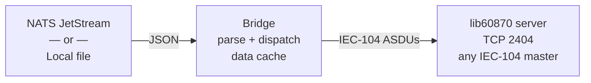
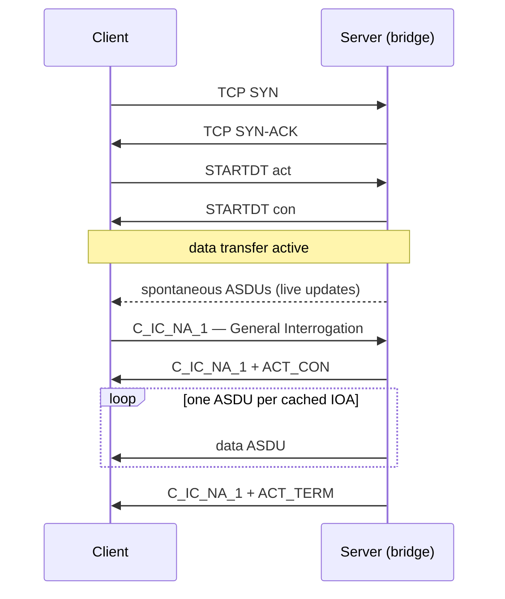

# IEC-104 Bridge

Reads JSON-encoded process values from a message source (NATS JetStream or a
local file) and forwards them to connected IEC-104 clients as spontaneous data
using [lib60870](https://github.com/mz-automation/lib60870).

---

## Architecture



The bridge maintains a **data cache** keyed by `(ca, ioa)`.  When a client
sends a **General Interrogation** command the bridge replays the most recent
value for every cached IOA.

---

## IEC-104 protocol primer

IEC 60870-5-104 (IEC-104) is a telecontrol protocol used in power-system
automation to exchange process data — breaker states, voltages, currents,
temperatures — between a **controlling station** (master) and one or more
**controlled stations** (outstations / RTUs).  It runs over TCP/IP, typically
on port **2404**.

### Roles

| Role | Also called | Description |
|---|---|---|
| **Server** (outstation) | RTU / IED / slave | Holds the live process data.  Accepts TCP connections, sends spontaneous updates, responds to commands. |
| **Client** (controlling station) | Master / SCADA | Initiates the TCP connection, subscribes to data, and may send control commands. |

This bridge acts as a **server**.  It accepts any number of simultaneous IEC-104
client connections and pushes data updates to all of them.

### Connection handshake



### Frame structure (APDU / ASDU)

Every TCP payload is an **APDU** (Application Protocol Data Unit):

```
┌─────────────────────────────────────────────────────────────────┐
│ Start byte  │ APDU length │  Control field (4 bytes)            │
│   0x68      │   1 byte    │  I / S / U frame type + seq. nos    │
├─────────────────────────────────────────────────────────────────┤
│                  ASDU  (I-frames only)                          │
│  Type ID │ VSQ │ COT │ Originator │  CA  │  Information objects │
│  1 byte  │1 byte│2 bytes│1 byte  │2 bytes│  variable length     │
└─────────────────────────────────────────────────────────────────┘
```

Key APDU types:

| Frame | Purpose |
|---|---|
| **I-frame** (Information) | Carries an ASDU — process data or command |
| **S-frame** (Supervisory) | Acknowledges received I-frames (flow control) |
| **U-frame** (Unnumbered) | Control messages: STARTDT, STOPDT, TESTFR |

Key ASDU fields:

| Field | Size | Description |
|---|---|---|
| **Type ID** | 1 byte | Kind of data (e.g. 13 = 32-bit float, 1 = single-point) |
| **VSQ** | 1 byte | Number of information objects; SQ bit for sequential IOAs |
| **COT** | 1 byte | Cause of Transmission (spontaneous=3, interrogated=20, …) |
| **CA** | 2 bytes | Common Address — identifies the outstation (1–65 534) |
| **IOA** | 3 bytes | Information Object Address — identifies one data point (1–16 777 215) |
| **Value + QDS** | varies | The measurement or state value plus a Quality Descriptor byte |

### Type IDs used by this bridge

| Type ID | Mnemonic | Value encoding | Use |
|---|---|---|---|
| 1 | M_SP_NA_1 | 1-bit boolean | Single-point status (ON/OFF, OPEN/CLOSED) |
| 9 | M_ME_NA_1 | 16-bit normalized float (-1.0 … +1.0) | Normalised measurements |
| 11 | M_ME_NB_1 | 16-bit signed integer | Scaled measurements (current, power) |
| 13 | M_ME_NC_1 | 32-bit IEEE 754 float | Short floating-point measurements |

### Quality Descriptor (QDS) bits

The QDS byte accompanies every measurement value.  The bridge maps the JSON
`"quality"` field to these bits:

| Bit | Flag | JSON quality value |
|---|---|---|
| 7 | **IV** – Invalid | `"invalid"` |
| 6 | **NT** – Not Topical (stale) | `"not_topical"` |
| 5 | **SB** – Substituted | `"substituted"` |
| 4 | **BL** – Blocked | `"blocked"` |
| 0 | **OV** – Overflow | `"overflow"` |
| — | *(none set)* | `"good"` |

---

## JSON message format

Every message must be a valid JSON object on a single line.  The bridge parses
it, looks up the right IEC-104 type and quality flags, and dispatches the
corresponding ASDU to all connected clients.

**Required fields** (the bridge will reject messages that omit either of these):

| Field | Type | Description |
|---|---|---|
| `ioa` | integer | **Information Object Address** — uniquely identifies one data point within a Common Address. Range: 1 – 16 777 215.  Maps to the 3-byte IOA field in every ASDU information object. |
| `value` | number or boolean | The process value to publish.  Scaled types are rounded and clamped to int16; float types are sent as IEEE 754; booleans map to single-point ON/OFF. |

**Optional fields:**

| Field | Type | Default | Description |
|---|---|---|---|
| `type` | string | inferred | IEC-104 encoding to use (see table below).  When omitted the type is inferred from the JSON value type. |
| `ca` | integer | `IEC104_CA` env var | **Common Address** — identifies the outstation.  Matches the CA the client filters on.  Range: 1 – 65 534. |
| `quality` | string | `"good"` | **Quality Descriptor** flags to attach to the measurement.  See Quality values below. |
| `cot` | string | `"spontaneous"` | **Cause of Transmission** — why this value is being sent.  Most upstream systems set `"spontaneous"` for live updates or `"periodic"` for timed scans. |

### `"type"` values

Selects the IEC-104 **Type ID** and wire encoding.  The bridge maps each
string to a specific ASDU type (see the Type IDs table in the protocol primer
above):

| `"type"` | IEC-104 type | Wire encoding |
|---|---|---|
| `"single_point"` | M_SP_NA_1 (1) | boolean ON/OFF |
| `"float"` | M_ME_NC_1 (13) | 32-bit IEEE 754 float |
| `"scaled"` | M_ME_NB_1 (11) | signed 16-bit integer, clamped |
| `"normalized"` | M_ME_NA_1 (9) | 16-bit normalized (sent as float) |
| `"double_point"` | *(fallback)* | sent as single point |

When `"type"` is omitted the type is **inferred from the JSON value**:

| JSON value | Inferred type |
|---|---|
| `true` / `false` | `single_point` |
| integer (`42`) | `scaled` |
| float (`3.14`) | `float` |

### `"quality"` values

Maps directly to the **Quality Descriptor (QDS)** byte sent in each ASDU (see
the QDS table in the protocol primer above).

`"good"` (default), `"invalid"`, `"not_topical"`, `"substituted"`, `"blocked"`, `"overflow"`

### `"cot"` values

The **Cause of Transmission** field (COT) appears in every ASDU header and
tells the client *why* this value is being sent.  Most consumers log or filter
on it.

`"spontaneous"` (default), `"periodic"`, `"background_scan"`, `"interrogated"`, `"return_info_remote"`, `"return_info_local"`

---

## Configuration

All configuration is via environment variables.

| Variable | Default | Description |
|---|---|---|
| `INPUT_FILE` | *(unset)* | Path to a `.jsonl` file for local dev/testing.  When set, NATS is not used.  An empty string is treated as unset. |
| `IEC104_PORT` | `2404` | TCP port for the IEC-104 server |
| `IEC104_CA` | `1` | Default Common Address when the message omits `"ca"` |
| `IEC104_BIND_ADDR` | `0.0.0.0` | Interface to bind on |
| `NATS_URL` | `nats://localhost:4222` | NATS server URL *(NATS mode only)* |
| `NATS_STREAM` | *(required)* | JetStream stream name *(NATS mode only)* |
| `NATS_CONSUMER` | *(required)* | Durable consumer name *(NATS mode only)* |
| `NATS_SUBJECT_FILTER` | *(unset)* | Optional subject filter *(NATS mode only)* |
| `RUST_LOG` | `iec104bridge=info` | Log level filter (uses `tracing-subscriber`) |

---

## Building

```bash
cargo build --release
# binary: target/release/iec104bridge
```

---

## Running with NATS

```bash
export NATS_URL="nats://localhost:4222"
export NATS_STREAM="sensors"
export NATS_CONSUMER="iec104bridge"
export NATS_SUBJECT_FILTER="plant.a.>"   # optional
export IEC104_PORT=2404
export IEC104_CA=1
cargo run
```

Publish a message:

```bash
nats pub plant.a.breaker '{"ioa":1001,"value":true,"type":"single_point"}'
nats pub plant.a.voltage '{"ioa":2001,"value":132.4,"type":"float"}'
```

---

## Example messages file

[`examples/messages.jsonl`](examples/messages.jsonl) contains a static DLR
snapshot matching the IOA scheme used by the demo publisher.  It is intended
for local `INPUT_FILE` testing; the live demo uses NATS.

| IOA range | CA | Type | Description |
|---|---|---|---|
| 1001 – 1010 | 1 or 2 | `float` | Span 1–10 conductor temperature (°C) |
| 2001 – 2010 | 1 or 2 | `scaled` | Span 1–10 ampacity (A) |
| 3001 | 1 or 2 | `scaled` | Line ampacity — min of valid spans (A) |

---

## Input sources

| Source | How to select | Use case |
|---|---|---|
| `NatsSource` | `INPUT_FILE` not set | Production / demo |
| `FileSource` | `INPUT_FILE=/path/to/file.jsonl` | Local dev testing, log replay |
| `IterSource` | Programmatically (tests only) | Unit / integration tests |

New sources can be added by implementing the `MessageSource` trait in
`src/source.rs`.  A Unix-socket or TCP-stream source is planned for scenarios
where a co-located process produces values without NATS.

---

## Integration guide

This section describes what information must be gathered before deploying the
bridge at a client site, and what decisions must be made jointly between the
client and the integrator.

### 1 — Information the client must provide

These are facts about the client's existing infrastructure that the bridge must
be configured to match.  The bridge cannot operate correctly without them.

#### IEC-104 network

| Item | Description | Example |
|---|---|---|
| **Bind address** | Interface the bridge should listen on.  Typically the IP of the NIC facing the SCADA network, or `0.0.0.0` to listen on all interfaces. | `192.168.10.5` |
| **IEC-104 port** | TCP port the client's master (SCADA) will connect to.  Default is `2404`; some installations use a non-standard port. | `2404` |
| **Common Address(es)** | The CA value(s) the SCADA master is configured to poll.  One CA per logical outstation.  Range: 1 – 65 534. | `1`, `42` |
| **Simultaneous client count** | Maximum number of IEC-104 masters that will connect at the same time.  Affects internal buffer sizing. | `2` |
| **Network path / firewall rules** | Confirmation that TCP on the chosen port is open between the SCADA host and bridge host. | — |

#### SCADA / master capabilities

| Item | Description |
|---|---|
| **Supported Type IDs** | Which encoding variants the master can consume (float M_ME_NC_1, scaled M_ME_NB_1, normalised M_ME_NA_1, single-point M_SP_NA_1).  Some legacy systems only handle scaled or normalised. |
| **Quality-flagged value handling** | Does the master alarm on IV (invalid) / NT (not topical), suppress display, substitute a default, or ignore quality entirely? |
| **COT filtering** | Does the master filter or treat differently values with COT = `spontaneous` vs `periodic` vs `interrogated`? |
| **GI trigger behaviour** | Does the master send General Interrogation (C_IC_NA_1) on connect, periodically, or on demand?  What response time is expected? |
| **IEC-104 parameter set** | Non-standard `T1`/`T2`/`T3` timer values or `k`/`w` window sizes if the master deviates from the IEC defaults. |

#### Upstream data bus (NATS)

| Item | Description | Example |
|---|---|---|
| **NATS server URL(s)** | Comma-separated list of `nats://host:port` entries for the cluster. | `nats://10.0.1.10:4222,nats://10.0.1.11:4222` |
| **Stream name** | Name of the existing JetStream stream that carries process values. | `PLANT_DATA` |
| **Consumer name** | Durable consumer name to create or attach to on the stream. | `iec104bridge` |
| **Subject filter** | Subject prefix or wildcard the bridge should subscribe to, if the stream carries mixed traffic. | `plant.line1.>` |
| **Authentication** | NATS credentials file path or username/password if the server requires auth. | `/etc/nats/bridge.creds` |

---

### 2 — Decisions to make jointly

These items have no single correct answer — they depend on the client's
operational conventions and the upstream data model.  They should be agreed and
documented before any configuration is written.

#### IOA allocation scheme

The most important shared design decision.  Every measurement that the bridge
publishes needs a unique IOA within its CA.  A consistent numbering convention
makes maintenance and troubleshooting much easier.

Suggested starting questions:

- Is there an existing IOA scheme already in use in the site's SCADA?  If so,
  the bridge must match it.
- If starting fresh: organise by signal type (all temperatures in one block, all
  currents in another) or by physical asset (all signals for span 1 together)?
- Do multiple CAs share the same IOA namespace, or is each CA independent?

Example scheme (DLR deployment, 2 lines × 10 spans):

| IOA range | CA | Signal |
|---|---|---|
| 1001 – 1010 | line number | Span 1–10 conductor temperature (°C), `float` |
| 2001 – 2010 | line number | Span 1–10 ampacity (A), `scaled` |
| 3001 | line number | Line ampacity — min of valid spans (A), `scaled` |

> **Deliverable:** an IOA register spreadsheet listing every `(ca, ioa)` pair,
> its engineering description, unit, Type ID, and the NATS subject/key that
> produces the value.

#### Type ID selection per signal

| Signal class | Recommended type | Rationale |
|---|---|---|
| Temperatures, voltages, continuous measurements | `float` (M_ME_NC_1) | Full precision; no scaling needed |
| Currents, powers with integer resolution | `scaled` (M_ME_NB_1) | Matches existing SCADA scaling factors |
| Status / binary states | `single_point` (M_SP_NA_1) | Correct semantics for ON/OFF |
| Legacy masters that require normalised values | `normalized` (M_ME_NA_1) | Only if master cannot handle float |

For `scaled` signals, agree on the **scaling factor**: the bridge sends the
raw integer value as-is (clamped to int16), so the upstream publisher and the
SCADA master must agree on what one LSB represents (e.g. 1 A, 0.1 A).

#### NATS subject naming convention

Define how upstream systems name their subjects so the bridge's subject filter
is unambiguous:

```
<site>.<asset-class>.<asset-id>.<signal>
plant.line.1.span.3.temperature
plant.line.1.span.3.ampacity
plant.line.1.line_ampacity
```

#### Quality propagation policy

Decide what happens when the upstream publisher reports degraded quality:

| Scenario | Options |
|---|---|
| Sensor reading is `"invalid"` | Publish with IV flag set; or suppress entirely and rely on NT (not topical) after a timeout |
| Communication loss to sensor | Set `"not_topical"` after _N_ seconds of no update |
| Maintenance substitution | Use `"substituted"` quality on injected values |
| Value exceeds sensor range | Use `"overflow"` and clamp to range limit |

#### Update rate and GI strategy

- What is the expected publish interval from the upstream data source?
- Should the SCADA master poll GI on connect only, or also periodically?
- If periodically: what interval is acceptable given the number of cached IOAs?

---

### 3 — Pre-deployment checklist

```
[ ] IEC-104 bind address and port confirmed, firewall rule open
[ ] Common Address(es) agreed and match SCADA configuration
[ ] IOA register complete and reviewed by SCADA team
[ ] Type IDs and scaling factors agreed for all scaled signals
[ ] NATS cluster URLs, stream name, consumer name, and credentials supplied
[ ] NATS subject naming convention agreed and applied to publisher
[ ] Quality propagation policy documented
[ ] Bridge environment variables written and reviewed (see Configuration table)
[ ] End-to-end test: publish one message per Type ID, confirm SCADA receives it
[ ] GI test: trigger General Interrogation, confirm all cached points returned
[ ] Failover test: disconnect and reconnect NATS; confirm bridge recovers
```
