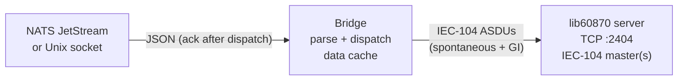
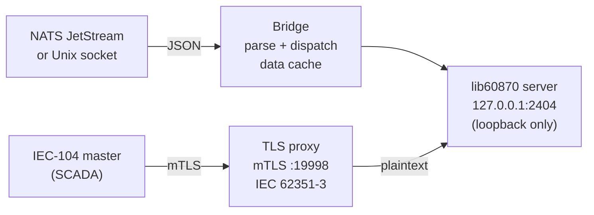
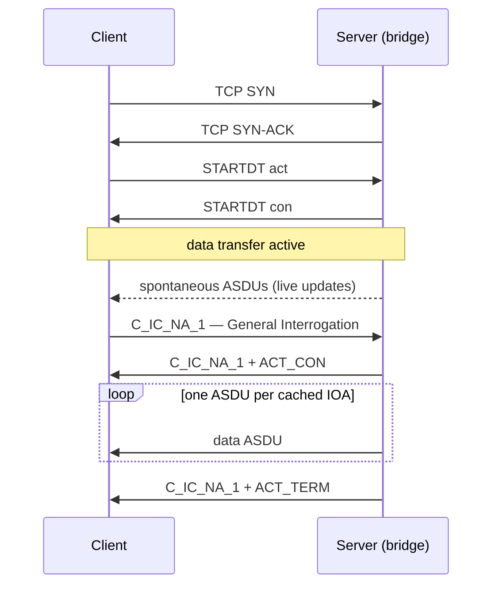
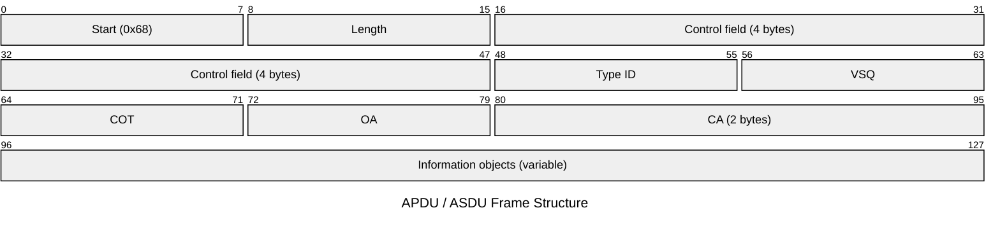

# IEC-104 Bridge

Reads JSON-encoded process values from either a NATS JetStream consumer or a
local Unix domain socket and forwards them to connected IEC-104 clients as
spontaneous data using
[lib60870](https://github.com/mz-automation/lib60870).

Optional **Mutual TLS (IEC 62351-3)** mode secures the IEC-104 transport layer
with client-certificate authentication.

---

## Architecture

### Plaintext mode (default)


```mermaid
flowchart LR
    upstream["NATS JetStream\nor Unix socket"]
    bridge["Bridge\nparse + dispatch\ndata cache"]
    clients["lib60870 server\nTCP :2404\nIEC-104 master(s)"]

    upstream -->|"JSON (ack after dispatch)"| bridge
    bridge -->|"IEC-104 ASDUs\n(spontaneous + GI)"| clients
```

### TLS mode (IEC 62351-3)

When `TLS_ENABLED=true` the lib60870 server binds on loopback only.  A
separate TLS listener (default port **19998**) handles mTLS handshakes and
proxies plaintext bytes to lib60870.


```mermaid
flowchart LR
    upstream["NATS JetStream\nor Unix socket"]
    bridge["Bridge\nparse + dispatch\ndata cache"]
    tls["TLS proxy\nmTLS :19998\nIEC 62351-3"]
    iec["lib60870 server\n127.0.0.1:2404\n(loopback only)"]
    master["IEC-104 master\n(SCADA)"]

    upstream -->|"JSON"| bridge
    bridge --> iec
    master -->|"mTLS"| tls
    tls -->|"plaintext"| iec
```

The bridge maintains a **data cache** keyed by `(ca, ioa)`.  When a client
sends a **General Interrogation** command the bridge replays the most recent
value for every cached IOA.

### Message acknowledgement

- NATS JetStream messages are acknowledged **after** `bridge::dispatch()` returns
  (i.e. after the ASDU has been enqueued in lib60870's outbound buffer). This
  means a crash between message receipt and dispatch causes the broker to
  redeliver the message rather than silently dropping it. Unparseable or
  semantically invalid messages are acknowledged immediately to prevent
  infinite redelivery.
- Unix-socket messages receive an `ok` line reply only after
  `bridge::dispatch()` returns. Parse, validation, or authorization failures
  receive an immediate `error ...` reply.

---

## IEC-104 protocol primer

IEC 60870-5-104 (IEC-104) is a telecontrol protocol used in power-system
automation to exchange process data — breaker states, voltages, currents,
temperatures — between a **controlling station** (master) and one or more
**controlled stations** (outstations / RTUs).  It runs over TCP/IP, typically
on port **2404**.

### Roles

| Role | Also called | Description |
|---|---|---|
| **Server** (outstation) | RTU / IED / slave | Holds the live process data.  Accepts TCP connections, sends spontaneous updates, responds to commands. |
| **Client** (controlling station) | Master / SCADA | Initiates the TCP connection, subscribes to data, and may send control commands. |

This bridge acts as a **server**.  It accepts any number of simultaneous IEC-104
client connections and pushes data updates to all of them.

### Connection handshake


```mermaid
sequenceDiagram
    participant C as Client
    participant S as Server (bridge)

    C->>S: TCP SYN
    S->>C: TCP SYN-ACK
    C->>S: STARTDT act
    S->>C: STARTDT con
    note over C,S: data transfer active
    S-->>C: spontaneous ASDUs (live updates)
    C->>S: C_IC_NA_1 — General Interrogation
    S->>C: C_IC_NA_1 + ACT_CON
    loop one ASDU per cached IOA
        S->>C: data ASDU
    end
    S->>C: C_IC_NA_1 + ACT_TERM
```

### Frame structure (APDU / ASDU)

Every TCP payload is an **APDU** (Application Protocol Data Unit):


```mermaid
packet-beta
title APDU / ASDU Frame Structure
0-7: "Start (0x68)"
8-15: "Length"
16-47: "Control field (4 bytes)"
48-55: "Type ID"
56-63: "VSQ"
64-71: "COT"
72-79: "OA"
80-95: "CA (2 bytes)"
96-127: "Information objects (variable)"
```

> The **Type ID** through **Information objects** fields form the **ASDU** and are
> only present in **I-frames**.  S-frames and U-frames carry only the
> 6-byte APDU header (Start + Length + Control field).

Key APDU types:

| Frame | Purpose |
|---|---|
| **I-frame** (Information) | Carries an ASDU — process data or command |
| **S-frame** (Supervisory) | Acknowledges received I-frames (flow control) |
| **U-frame** (Unnumbered) | Control messages: STARTDT, STOPDT, TESTFR |

Key ASDU fields:

| Field | Size | Description |
|---|---|---|
| **Type ID** | 1 byte | Kind of data (e.g. 13 = 32-bit float, 1 = single-point) |
| **VSQ** | 1 byte | Number of information objects; SQ bit for sequential IOAs |
| **COT** | 1 byte | Cause of Transmission (spontaneous=3, interrogated=20, …); top 2 bits are T (test) and P/N (positive/negative) flags |
| **OA** | 1 byte | Originator Address — identifies the controlling station that initiated the command (0 = no originator) |
| **CA** | 2 bytes | Common Address — identifies the outstation (1–65 534) |
| **IOA** | 3 bytes | Information Object Address — identifies one data point (1–16 777 215) |
| **Value + QDS** | varies | The measurement or state value plus a Quality Descriptor byte |

### Type IDs used by this bridge

| Type ID | Mnemonic | Value encoding | Use |
|---|---|---|---|
| 1 | M_SP_NA_1 | 1-bit boolean | Single-point status (ON/OFF, OPEN/CLOSED) |
| 9 | M_ME_NA_1 | 16-bit normalized float (-1.0 … +1.0) | Normalised measurements |
| 11 | M_ME_NB_1 | 16-bit signed integer | Scaled measurements (current, power) |
| 13 | M_ME_NC_1 | 32-bit IEEE 754 float | Short floating-point measurements |

### Quality Descriptor (QDS) bits

The QDS byte accompanies every measurement value.  The bridge maps the JSON
`"quality"` field to these bits:

| Bit | Flag | JSON quality value |
|---|---|---|
| 7 | **IV** – Invalid | `"invalid"` |
| 6 | **NT** – Not Topical (stale) | `"not_topical"` |
| 5 | **SB** – Substituted | `"substituted"` |
| 4 | **BL** – Blocked | `"blocked"` |
| 0 | **OV** – Overflow | `"overflow"` |
| — | *(none set)* | `"good"` |

---

## JSON message format

Every message must be a valid JSON object on a single line.  The bridge parses
it, looks up the right IEC-104 type and quality flags, and dispatches the
corresponding ASDU to all connected clients.

**Required fields** (the bridge will reject messages that omit either of these):

| Field | Type | Description |
|---|---|---|
| `ioa` | integer | **Information Object Address** — uniquely identifies one data point within a Common Address. Range: 1 – 16 777 215.  Maps to the 3-byte IOA field in every ASDU information object. |
| `value` | number or boolean | The process value to publish.  Scaled types are rounded and clamped to int16; float types are sent as IEEE 754; booleans map to single-point ON/OFF. |

**Optional fields:**

| Field | Type | Default | Description |
|---|---|---|---|
| `type` | string | inferred | IEC-104 encoding to use (see table below).  When omitted the type is inferred from the JSON value type. |
| `ca` | integer | `IEC104_CA` env var | **Common Address** — identifies the outstation.  Matches the CA the client filters on.  Range: 1 – 65 534. |
| `quality` | string | `"good"` | **Quality Descriptor** flags to attach to the measurement.  See Quality values below. |
| `cot` | string | `"spontaneous"` | **Cause of Transmission** — why this value is being sent.  Most upstream systems set `"spontaneous"` for live updates or `"periodic"` for timed scans. |
| `timestamp` | RFC3339 timestamp with timezone/offset | omitted | **Source timestamp** for the value. When present the bridge emits the CP56Time2a-tagged IEC-104 variant for the selected point type and preserves the timestamp for GI replay. |

### `"type"` values

Selects the IEC-104 **Type ID** and wire encoding.  The bridge maps each
string to a specific ASDU type (see the Type IDs table in the protocol primer
above):

| `"type"` | IEC-104 type | Wire encoding |
|---|---|---|
| `"single_point"` | M_SP_NA_1 (1) | boolean ON/OFF |
| `"single_point"` + `timestamp` | M_SP_TB_1 (30) | boolean ON/OFF + CP56Time2a |
| `"float"` | M_ME_NC_1 (13) | 32-bit IEEE 754 float |
| `"float"` + `timestamp` | M_ME_TF_1 (36) | 32-bit IEEE 754 float + CP56Time2a |
| `"scaled"` | M_ME_NB_1 (11) | signed 16-bit integer, clamped |
| `"scaled"` + `timestamp` | M_ME_TE_1 (35) | signed 16-bit integer + CP56Time2a |
| `"normalized"` | M_ME_NA_1 (9) | 16-bit normalized (sent as float) |
| `"normalized"` + `timestamp` | M_ME_TD_1 (34) | normalized float + CP56Time2a |
| `"double_point"` | *(fallback)* | sent as single point |

When `"type"` is omitted the type is **inferred from the JSON value**:

| JSON value | Inferred type |
|---|---|
| `true` / `false` | `single_point` |
| integer (`42`) | `scaled` |
| float (`3.14`) | `float` |

### `"quality"` values

Maps directly to the **Quality Descriptor (QDS)** byte sent in each ASDU (see
the QDS table in the protocol primer above).

`"good"` (default), `"invalid"`, `"not_topical"`, `"substituted"`, `"blocked"`, `"overflow"`

### `"cot"` values

The **Cause of Transmission** field (COT) appears in every ASDU header and
tells the client *why* this value is being sent.  Most consumers log or filter
on it.

`"spontaneous"` (default), `"periodic"`, `"background_scan"`, `"interrogated"`, `"return_info_remote"`, `"return_info_local"`

---

## Configuration

All configuration is via environment variables.

### Core settings

| Variable | Default | Description |
|---|---|---|
| `INPUT_TRANSPORT` | `nats` | Upstream input transport: `nats` or `unix_socket` |
| `IEC104_PORT` | `2404` | TCP port for the IEC-104 server |
| `IEC104_CA` | `1` | Default Common Address when the message omits `"ca"` |
| `IEC104_GI_ONLY` | `false` | When `true`, cache updates silently and serve points only on General Interrogation |
| `IEC104_BIND_ADDR` | `0.0.0.0` | Interface to bind on (overridden to `127.0.0.1` when TLS is enabled) |
| `METRICS_PORT` | `9091` | TCP port for the Prometheus metrics HTTP endpoint |
| `RUST_LOG` | `iec104bridge=info` | Log level filter (uses `tracing-subscriber`) |

### NATS input

These variables are required only when `INPUT_TRANSPORT=nats`.

| Variable | Default | Description |
|---|---|---|
| `NATS_URL` | `nats://localhost:4222` | NATS server URL (comma-separated for clusters) |
| `NATS_STREAM` | *(required)* | JetStream stream name |
| `NATS_CONSUMER` | *(required)* | Durable consumer name |
| `NATS_SUBJECT_FILTER` | *(unset)* | Optional subject filter applied at the consumer |
| `NATS_CREDENTIALS` | *(unset)* | Path to a NATS credentials file (`.creds`) for JWT/NKey authentication.  Generated by the `nsc` tool.  When unset the bridge connects without authentication. |

### Unix-socket input

These variables are used only when `INPUT_TRANSPORT=unix_socket`.

| Variable | Default | Description |
|---|---|---|
| `UNIX_SOCKET_PATH` | `/run/iec104bridge/input.sock` | Filesystem path of the local Unix domain socket listener |
| `UNIX_SOCKET_ALLOWED_UID` | *(unset)* | Optional effective UID allowed to connect |
| `UNIX_SOCKET_ALLOWED_GID` | *(unset)* | Optional effective GID allowed to connect |
| `UNIX_SOCKET_MAX_LINE_BYTES` | `65536` | Maximum bytes accepted for one newline-delimited JSON request |

### Transport security (IEC 62351-3 / mTLS)

| Variable | Default | Description |
|---|---|---|
| `TLS_ENABLED` | `false` | Set to `true`, `1`, or `yes` to enable Mutual TLS |
| `TLS_PORT` | `19998` | External TLS listener port (IANA-registered IEC 62351-3 port) |
| `TLS_CERT_PATH` | *(required when TLS on)* | Path to the server's PEM certificate chain |
| `TLS_KEY_PATH` | *(required when TLS on)* | Path to the server's PEM private key (PKCS-8 or PKCS-1) |
| `TLS_CA_CERT_PATH` | *(required when TLS on)* | Path to the Root CA PEM used to verify **client** certificates |

When `TLS_ENABLED=true`:
- The IEC-104 server binds on `127.0.0.1:IEC104_PORT` (loopback only — not directly reachable from the network).
- A TLS proxy listens on `IEC104_BIND_ADDR:TLS_PORT`, performs the mTLS handshake, and forwards plaintext to lib60870.
- All three certificate paths are **required** — the bridge refuses to start if any is missing.
- rustls's default cipher suite list is used: TLS 1.3 (preferred) + TLS 1.2. No unsafe ciphers are enabled.

---

## Building

```bash
cargo build --release
# binary: target/release/iec104bridge
```

---

## Running

### Plaintext mode

```bash
export INPUT_TRANSPORT=nats
export NATS_URL="nats://localhost:4222"
export NATS_STREAM="sensors"
export NATS_CONSUMER="iec104bridge"
export NATS_SUBJECT_FILTER="plant.a.>"   # optional
export IEC104_PORT=2404
export IEC104_CA=1
cargo run
```

Publish a test message:

```bash
nats pub plant.a.breaker '{"ioa":1001,"value":true,"type":"single_point"}'
nats pub plant.a.voltage '{"ioa":2001,"value":132.4,"type":"float"}'
```

### mTLS mode (IEC 62351-3)

Generate test certificates (replace with your CA-issued certificates in production):

```bash
# Root CA
openssl req -x509 -newkey ec -pkeyopt ec_paramgen_curve:P-256 -days 3650 \
    -keyout ca.key -out ca.crt -nodes -subj "/CN=IEC62351-CA"

# Server key + CSR + sign
openssl req -newkey ec -pkeyopt ec_paramgen_curve:P-256 \
    -keyout server.key -out server.csr -nodes -subj "/CN=iec104bridge"
openssl x509 -req -in server.csr -CA ca.crt -CAkey ca.key \
    -CAcreateserial -out server.crt -days 365

# Client key + CSR + sign (for the SCADA master)
openssl req -newkey ec -pkeyopt ec_paramgen_curve:P-256 \
    -keyout client.key -out client.csr -nodes -subj "/CN=scada-master"
openssl x509 -req -in client.csr -CA ca.crt -CAkey ca.key \
    -CAcreateserial -out client.crt -days 365
```

Run the bridge in TLS mode:

```bash
export INPUT_TRANSPORT=nats
export NATS_URL="nats://localhost:4222"
export NATS_STREAM="sensors"
export NATS_CONSUMER="iec104bridge"
export TLS_ENABLED=true
export TLS_CERT_PATH=/etc/iec104/server.crt
export TLS_KEY_PATH=/etc/iec104/server.key
export TLS_CA_CERT_PATH=/etc/iec104/ca.crt
# TLS_PORT defaults to 19998; IEC104_PORT stays 2404 (loopback only)
cargo run
```

The bridge will:
1. Bind lib60870 on `127.0.0.1:2404` (not externally reachable).
2. Start a TLS listener on `0.0.0.0:19998`.
3. Reject any client that does not present a certificate signed by `ca.crt`.
4. Log a warning with the failure reason for any failed handshake.

### Local Unix-socket mode

```bash
mkdir -p /run/iec104bridge
export INPUT_TRANSPORT=unix_socket
export UNIX_SOCKET_PATH=/run/iec104bridge/input.sock
export UNIX_SOCKET_ALLOWED_UID=$(id -u bridge-publisher)
export UNIX_SOCKET_ALLOWED_GID=$(id -g bridge-publisher)
export IEC104_PORT=2404
export IEC104_CA=1
cargo run
```

Send a test message with `socat`:

```bash
printf '{"ioa":1001,"value":132.4,"type":"float"}\n' \
  | socat - UNIX-CONNECT:/run/iec104bridge/input.sock
```

Expected response:

```text
ok
```

Or use the bundled Python example:

```bash
python examples/unix_socket_sender.py /run/iec104bridge/input.sock
```

### Manual timestamp verification

Use the bundled stdout scraper to confirm that timestamped Unix-socket input is
emitted as timed IEC ASDUs with CP56Time2a timestamps.

1. Start the bridge in Unix-socket mode:

```bash
mkdir -p "$XDG_RUNTIME_DIR/iec104bridge"
export INPUT_TRANSPORT=unix_socket
export UNIX_SOCKET_PATH="$XDG_RUNTIME_DIR/iec104bridge/input.sock"
export IEC104_PORT=2404
export IEC104_CA=1
nix develop -c cargo run
```

2. In a second shell, start the stdout scraper and issue one GI for CA 1:

```bash
BRIDGE_HOST=127.0.0.1 BRIDGE_PORT=2404 GI_INTERVAL=0 GI_CAS=1 \
  nix develop -c python demo/scraper/print_messages.py
```

3. In a third shell, send a timestamped socket message:

```bash
python examples/unix_socket_sender.py "$XDG_RUNTIME_DIR/iec104bridge/input.sock"
```

4. In the scraper output, confirm you see a JSON line like this:

```json
{"ca": 1, "ioa": 1001, "type_id": 36, "cot": 3, "value": 132.4, "qds": 0, "timestamp": "2026-06-01T12:34:56.789Z"}
```

Expected values:
- `type_id: 36` means `M_ME_TF_1` (timed float)
- `timestamp` must match the timestamp from the socket JSON
- `cot: 3` means spontaneous
- `qds: 0` means good quality

The bridge only applies `0750` permissions when it creates the socket parent
directory itself. For existing directories such as `/tmp` or `/run`, it leaves
the parent mode unchanged and only applies `0660` to the socket file.

### Unix-socket protocol

- One JSON object per line.
- The payload schema is the same `Iec104Message` schema used by NATS mode.
- `timestamp` is optional; when present it must be RFC3339 and is preserved in the bridge cache for GI replay.
- The bridge replies with one line per request:
  - `ok`
  - `error parse`
  - `error validation`
  - `error unauthorized`
- The bridge validates `ioa`, `ca`, normalized value bounds, and boolean-only
  `single_point` / `double_point` payloads before dispatch.
- The bridge sets the socket directory to `0750` and the socket file to `0660`.
  Prefer a dedicated service user and a runtime directory under `/run`.

---

## Example messages file

[`examples/messages.jsonl`](examples/messages.jsonl) contains a static DLR
snapshot matching the IOA scheme used by the demo publisher.  It is intended
as a reference for IOA layout and message format; the live demo uses NATS.

| IOA range | CA | Type | Description |
|---|---|---|---|
| 1001 – 1010 | 1 or 2 | `float` | Span 1–10 conductor temperature (°C) |
| 2001 – 2010 | 1 or 2 | `scaled` | Span 1–10 ampacity (A) |
| 3001 | 1 or 2 | `scaled` | Line ampacity — min of valid spans (A) |

---

## Input sources

| Source | How to select | Use case |
|---|---|---|
| `NatsSource` | `INPUT_TRANSPORT=nats` | Production / demo |
| `UnixSocketSource` | `INPUT_TRANSPORT=unix_socket` | Single-host local publisher |
| `IterSource` | Programmatically (tests only) | Unit / integration tests |

New sources can be added by implementing the `MessageSource` trait in
`src/source.rs`.

---


## Integration guide

This section describes what information must be gathered before deploying the
bridge at a client site, and what decisions must be made jointly between the
client and the integrator.

### 1 — Information the client must provide

These are facts about the client's existing infrastructure that the bridge must
be configured to match.  The bridge cannot operate correctly without them.

#### IEC-104 network

| Item | Description | Example |
|---|---|---|
| **Bind address** | Interface the bridge should listen on.  Typically the IP of the NIC facing the SCADA network, or `0.0.0.0` to listen on all interfaces. | `192.168.10.5` |
| **IEC-104 port** | TCP port lib60870 binds on.  In plaintext mode this is the external port; in TLS mode it is loopback-only and `TLS_PORT` (19998) is the external port. | `2404` |
| **Common Address(es)** | The CA value(s) the SCADA master is configured to poll.  One CA per logical outstation.  Range: 1 – 65 534. | `1`, `42` |
| **Simultaneous client count** | Maximum number of IEC-104 masters that will connect at the same time.  For information only — the bridge currently accepts all incoming connections; lib60870's internal limit applies. | `2` |
| **Transport security required?** | Does the client's security policy mandate IEC†62351-3 (mTLS)?  If yes, collect the certificate artefacts listed below. | yes / no |
| **Network path / firewall rules** | Confirmation that TCP on the chosen port (2404 plaintext, or 19998 TLS) is open between the SCADA host and bridge host. | — |

#### Transport security / IEC 62351-3 (when required)

| Item | Description | Example |
|---|---|---|
| **CA certificate** | PEM file of the Root CA that has signed — and will sign — all device certificates on this installation.  Used to verify both the server cert and all client certs. | `root-ca.crt` |
| **Server certificate + key** | PEM certificate chain and private key for the bridge itself, signed by the CA above.  The CN or SAN should identify the bridge host. | `server.crt`, `server.key` |
| **Client certificate(s)** | Certificate(s) issued by the same CA for each SCADA master that will connect.  The bridge does not need these files — they must be installed on the master side — but the integrator must confirm they have been issued and are trusted by the CA. | `scada-master.crt` |
| **Certificate validity / renewal** | Expiry dates and renewal process.  The bridge logs a warning on failed handshakes (including expired certs) but does not auto-renew. | annual renewal |
| **TLS port** | External port for the TLS listener (default `19998`).  Confirm firewall permits this port from all master IP addresses. | `19998` |

#### SCADA / master capabilities

| Item | Description |
|---|---|
| **Supported Type IDs** | Which encoding variants the master can consume (float M_ME_NC_1, scaled M_ME_NB_1, normalised M_ME_NA_1, single-point M_SP_NA_1).  Some legacy systems only handle scaled or normalised. |
| **Quality-flagged value handling** | Does the master alarm on IV (invalid) / NT (not topical), suppress display, substitute a default, or ignore quality entirely? |
| **COT filtering** | Does the master filter or treat differently values with COT = `spontaneous` vs `periodic` vs `interrogated`? |
| **GI trigger behaviour** | Does the master send General Interrogation (C_IC_NA_1) on connect, periodically, or on demand?  What response time is expected? |


#### Upstream data bus (NATS or local publisher)

Choose exactly one upstream mode for a deployment.

##### NATS

| Item | Description | Example |
|---|---|---|
| **NATS server URL(s)** | Comma-separated list of `nats://host:port` entries for the cluster. | `nats://10.0.1.10:4222,nats://10.0.1.11:4222` |
| **Stream name** | Name of the existing JetStream stream that carries process values. | `PLANT_DATA` |
| **Consumer name** | Durable consumer name to create or attach to on the stream. | `iec104bridge` |
| **Subject filter** | Subject prefix or wildcard the bridge should subscribe to, if the stream carries mixed traffic. | `plant.line1.>` |
| **Authentication** | Whether the NATS server requires authentication.  If yes, provide the path to the `.creds` file generated by `nsc` (contains both the User JWT and NKey seed). | `/etc/nats/bridge.creds` |

##### Local Unix socket

| Item | Description | Example |
|---|---|---|
| **Socket path** | Runtime path where the local publisher connects. Prefer a dedicated directory under `/run`. | `/run/iec104bridge/input.sock` |
| **Publisher service user** | Linux user account that owns the companion process. | `bridge-publisher` |
| **Allowed UID/GID** | Effective UID/GID configured in `UNIX_SOCKET_ALLOWED_UID` / `UNIX_SOCKET_ALLOWED_GID` to restrict local access. | `991` / `991` |
| **Reconnect behavior** | How the companion process retries on socket disconnects or `error internal` replies. | exponential backoff |
| **Message timeout** | Maximum time the companion process waits for an `ok` / `error ...` reply before retrying. | `5s` |

---

### 2 — Decisions to make jointly

These items have no single correct answer — they depend on the client's
operational conventions and the upstream data model.  They should be agreed and
documented before any configuration is written.

#### IOA allocation scheme

The most important shared design decision.  Every measurement that the bridge
publishes needs a unique IOA within its CA.  A consistent numbering convention
makes maintenance and troubleshooting much easier.

Suggested starting questions:

- Is there an existing IOA scheme already in use in the site's SCADA?  If so,
  the bridge must match it.
- If starting fresh: organise by signal type (all temperatures in one block, all
  currents in another) or by physical asset (all signals for span 1 together)?
- Do multiple CAs share the same IOA namespace, or is each CA independent?

Example scheme (DLR deployment, 2 lines × 10 spans):

| IOA range | CA | Signal |
|---|---|---|
| 1001 – 1010 | line number | Span 1–10 conductor temperature (°C), `float` |
| 2001 – 2010 | line number | Span 1–10 ampacity (A), `scaled` |
| 3001 | line number | Line ampacity — min of valid spans (A), `scaled` |

> **Deliverable:** an IOA register spreadsheet listing every `(ca, ioa)` pair,
> its engineering description, unit, Type ID, and the NATS subject or local
> publisher key that produces the value.

#### Type ID selection per signal

| Signal class | Recommended type | Rationale |
|---|---|---|
| Temperatures, voltages, continuous measurements | `float` (M_ME_NC_1) | Full precision; no scaling needed |
| Currents, powers with integer resolution | `scaled` (M_ME_NB_1) | Matches existing SCADA scaling factors |
| Status / binary states | `single_point` (M_SP_NA_1) | Correct semantics for ON/OFF |
| Legacy masters that require normalised values | `normalized` (M_ME_NA_1) | Only if master cannot handle float |

For `scaled` signals, agree on the **scaling factor**: the bridge sends the
raw integer value as-is (clamped to int16), so the upstream publisher and the
SCADA master must agree on what one LSB represents (e.g. 1 A, 0.1 A).

#### Upstream naming convention

When NATS is used, define how upstream systems name their subjects so the
bridge's subject filter is unambiguous:

```
<site>.<asset-class>.<asset-id>.<signal>
plant.line.1.span.3.temperature
plant.line.1.span.3.ampacity
plant.line.1.line_ampacity
```

#### Quality propagation policy

Decide what happens when the upstream publisher reports degraded quality:

| Scenario | Options |
|---|---|
| Sensor reading is `"invalid"` | Publish with IV flag set; or suppress entirely and rely on NT (not topical) after a timeout |
| Communication loss to sensor | Set `"not_topical"` after _N_ seconds of no update |
| Maintenance substitution | Use `"substituted"` quality on injected values |
| Value exceeds sensor range | Use `"overflow"` and clamp to range limit |

#### Update rate and GI strategy

- What is the expected publish interval from the upstream data source?
- Should the SCADA master poll GI on connect only, or also periodically?
- If periodically: what interval is acceptable given the number of cached IOAs?

---

### 3 — Pre-deployment checklist

- [ ] IEC-104 bind address and port confirmed, firewall rule open
- [ ] Common Address(es) agreed and match SCADA configuration
- [ ] IOA register complete and reviewed by SCADA team
- [ ] Type IDs and scaling factors agreed for all scaled signals
- [ ] Exactly one upstream mode selected: NATS or Unix socket
- [ ] If NATS is used: cluster URLs, stream name, and consumer name supplied; credentials file provided if authentication is required
- [ ] If NATS is used: subject naming convention agreed and applied to publisher
- [ ] If Unix socket is used: socket path, runtime directory ownership, and allowed UID/GID documented
- [ ] Quality propagation policy documented
- [ ] Bridge environment variables written and reviewed (see Configuration table)
- [ ] End-to-end test: publish one message per Type ID, confirm SCADA receives it
- [ ] GI test: trigger General Interrogation, confirm all cached points returned
- [ ] Failover test: disconnect and reconnect the selected upstream transport; confirm bridge recovers

#### If TLS / IEC 62351-3 is required:
- [ ] Root CA certificate obtained and trusted by both bridge and SCADA master
- [ ] Server certificate and private key issued, signed by Root CA
- [ ] Client certificate(s) issued for each SCADA master, signed by Root CA
- [ ] TLS_ENABLED=true and all three TLS_*_PATH vars set in bridge config
- [ ] Firewall permits TCP on TLS_PORT (default 19998) from master IP(s)
- [ ] Handshake test: connect a test client with the client cert, confirm bridge logs.
- [ ] Rejection test: connect without a client cert, confirm bridge logs
- [ ] Certificate expiry dates recorded; renewal procedure agreed
